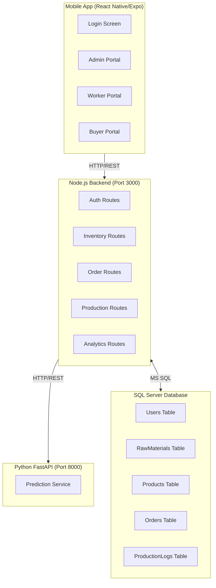

# ThreadTrack - Comprehensive System Inspection Report

**Project Name:** ThreadTrack  
**Inspection Date:** February 20, 2026  
**Inspection Type:** Full System Analysis (Architecture, Functionality, UX/UI, Gaps & Improvements)  
**Reviewer:** System Architect

---

## 1. Executive Summary

### 1.1 Project Overview
ThreadTrack is a B2B supply chain and inventory management system designed for manufacturing facilities. It connects three key stakeholders:

- **Factory Admin**: Manages inventory, tracks production, views analytics and AI-driven predictions
- **Floor Worker**: Logs daily production output against orders
- **B2B Buyer**: Places bulk orders and tracks order fulfillment progress

### 1.2 Problem Solved
ThreadTrack addresses critical real-world manufacturing challenges:

| Problem | Solution Provided |
|---------|-------------------|
| Poor inventory visibility | Real-time raw material tracking with low-stock alerts |
| Manual production logging | Digital worker input with automatic inventory deduction |
| Order tracking opacity | Buyer-facing progress tracking with percentage completion |
| Reactive inventory management | AI-powered stockout prediction (Python service) |
| Lack of production analytics | Weekly production charts and worker performance metrics |

### 1.3 Technology Stack
- **Backend (API)**: Node.js + Express
- **Predictive Engine**: Python FastAPI
- **Database**: Microsoft SQL Server
- **Mobile App**: React Native (Expo)
- **UI Framework**: React Native Paper (Material Design 3)

---

## 2. Architecture Analysis

### 2.1 System Architecture Diagram



### 2.2 API Endpoints Summary

| Route | Methods | Auth | Description |
|-------|---------|------|-------------|
| `/api/auth/login` | POST | Public | User authentication |
| `/api/auth/register` | POST | Public | New user registration |
| `/api/inventory/materials` | GET, POST, PUT, DELETE | Admin | Raw material CRUD |
| `/api/inventory/products` | GET, POST, PUT, DELETE | Admin (write), All (read) | Product management |
| `/api/orders` | GET, POST, PUT, DELETE | Role-based | Order management |
| `/api/production/log` | POST | Worker | Log production output |
| `/api/production/logs/:workerId` | GET | Worker/Admin | View worker logs |
| `/api/analytics/predict` | GET | Admin | AI stockout predictions |
| `/api/analytics/production-summary` | GET | Admin | Production analytics |

---

## 3. Functional Analysis

### 3.1 Authentication & Authorization

**Current Implementation:**
- JWT-based authentication with 1-hour token expiration
- Role-based access control (Admin, Worker, Buyer)
- Password hashing with bcrypt (10 rounds)

**Strengths:**
- Proper password hashing with salt
- Role-based route protection middleware
- Token embedded in Authorization header

**Gaps & Issues:**
1. **Hardcoded JWT Secret**: Uses `process.env.JWT_SECRET` but no default value in code
2. **Short Token Expiration**: 1 hour is impractical for a full workday - should be 8-24 hours
3. **No Token Refresh Mechanism**: Users must re-login after expiration
4. **No Session Management**: No way to invalidate tokens on logout (blacklist not implemented)
5. **Weak Default Roles**: Registration defaults to 'Buyer' if invalid role provided

### 3.2 Inventory Management

**Features Implemented:**
- Raw material CRUD operations
- Stock level tracking with minimum thresholds
- Product management linked to base materials
- Automatic stock deduction on production logging
- Low-stock alert indicators

**Workflow:**
```
Admin adds Raw Material → Admin creates Product (links to material) → 
Worker logs production → System deducts material automatically
```

**Gaps & Issues:**
1. **No Batch Import**: Manual entry only for materials/products
2. **No Barcode/QR Support**: Cannot scan materials/products
3. **Unit Management**: No standardization of units (can enter inconsistent units)
4. **Material History**: No audit trail of stock changes
5. **Multiple Material Support**: Products limited to single base material (should support multiple)

### 3.3 Order Management

**Features Implemented:**
- Buyer creates orders (product + quantity)
- Order status workflow: Pending → In Progress → Completed
- Order cancellation (buyer can cancel pending orders)
- Production progress tracking per order
- Completion notes/remarks

**Gaps & Issues:**
1. **No Order Editing**: Cannot modify quantity after order creation
2. **No Partial Cancellation**: Cannot cancel specific quantities
3. **No Order Notifications**: Buyers not notified of status changes
4. **Estimated Completion Date**: Hardcoded to +7 days (line 181, buyer/index.tsx) - should calculate based on production rate
5. **No Order Documents**: No invoice/PDF generation for orders
6. **No Order Analytics**: Buyers cannot see historical spending patterns

### 3.4 Production Logging

**Features Implemented:**
- Worker logs daily output
- Links to specific order for tracking
- Automatic material consumption calculation
- Automatic order status update when complete

**Gaps & Issues:**
1. **No Quality Metrics**: Cannot record defect rates or quality scores
2. **No Shift Management**: Cannot differentiate between day/night shifts
3. **No Worker Assignment**: Cannot assign specific workers to specific orders
4. **No Production Targets**: No way to set daily/weekly targets for workers
5. **Offline Support**: No offline capability - requires constant connectivity
6. **No Production Rate Calculation**: System doesn't calculate units-per-hour or efficiency metrics

### 3.5 Analytics & Predictions

**Backend Analytics:**
- Weekly production output (line chart)
- Worker productivity metrics (bar chart)
- Order completion rates

**Python Prediction Service:**
- Stockout day estimation based on 7-day average consumption
- Warning status when stock < 3 days remaining

**Gaps & Issues:**
1. **Static 7-Day Window**: Prediction only uses last 7 days - should allow configuration
2. **No Seasonal Adjustment**: Doesn't account for production cycles
3. **No Supplier Lead Time**: Doesn't recommend reorder quantities
4. **No Cost Analysis**: No profitability metrics
5. **Limited Historical Data**: Only sees production logs, not orders placed vs delivered
6. **No Dashboard Customization**: Admin cannot customize metrics displayed
7. **Predictions Not Automated**: No automated alerts when threshold crossed

---

## 4. UX/UI Analysis

### 4.1 Mobile App Screens

| Screen | Purpose | Issues Found |
|--------|---------|--------------|
| Login | Authentication | Dev quick-access buttons visible in production |
| Admin Dashboard | Analytics overview | Charts may not render with empty data |
| Admin Inventory | Stock management | Progress bar calculation: `MinimumRequired * 5` is arbitrary (line 105) |
| Admin Orders | Active orders | Search works but no filters |
| Admin Order Detail | Single order view | Timeline shows worker name but no quantity comparison |
| Worker Input | Log production | No validation if material stock is insufficient |
| Buyer Orders | Order list | New order modal has no price display |
| Settings | App settings | Notifications, Language, Privacy non-functional |

### 4.2 UI/UX Strengths

1. **Material Design 3**: Consistent theming with React Native Paper
2. **Dark Mode Support**: Full dark/light theme toggle with persistence
3. **Responsive Design**: Web and mobile layouts handled separately
4. **Loading States**: Activity indicators during data fetch
5. **Error Handling**: User-friendly error messages with retry options
6. **Pull to Refresh**: All list screens support refresh

### 4.3 UI/UX Gaps

1. **Dev Quick-Access Buttons**: Login screen shows Admin/Worker/Buyer buttons for testing - MUST remove for production
2. **No Empty States**: Screens don't have helpful messages when no data
3. **Inconsistent Navigation**: Worker/Buyer use Appbar for logout, Admin uses settings screen
4. **No Onboarding**: New users get no guidance
5. **Hardcoded Strings**: No i18n/translation support
6. **Limited Accessibility**: No screen reader support, missing alt text
7. **No Skeleton Loading**: Shows spinner instead of skeleton placeholders

### 4.4 Cross-Platform Issues

| Issue | Location | Impact |
|-------|----------|--------|
| Hardcoded IP Address | api.ts line 5 | Won't work on different networks |
| Platform-specific code | Multiple files | More testing required for web |
| No PWA Support | Mobile only | Cannot install as web app |
| No Push Notifications | Settings screen | Can't receive order alerts |

---

## 5. Security Analysis

### 5.1 Security Strengths
- Password hashing with bcrypt
- JWT token authentication
- Role-based route protection
- SQL injection prevention (parameterized queries)
- CORS configuration

### 5.2 Security Vulnerabilities

| Issue | Severity | Location | Recommendation |
|-------|----------|----------|----------------|
| No rate limiting | High | server.js | Add express-rate-limit |
| No input sanitization | Medium | All routes | Add validation library (Joi/zod) |
| JWT secret not validated | Critical | auth.js | Add env validation on startup |
| Error messages leak info | Low | Various | Sanitize error responses |
| No HTTPS enforcement | Critical | server.js | Redirect HTTP to HTTPS |
| No CORS whitelist | Medium | server.js | Specify exact allowed origins |
| Hardcoded seed passwords | High | schema.sql line 66-70 | Remove before deployment |

---

## 6. Database Analysis

### 6.1 Schema Design Strengths
- Proper foreign key relationships
- CHECK constraints for status values
- Default timestamps
- Unique constraints on usernames

### 6.2 Database Gaps

1. **No User Profile**: Cannot store user details (name, email, phone)
2. **No Supplier Table**: Cannot track material suppliers
3. **No Price History**: Cannot see historical product pricing
4. **No Audit Logs**: Cannot track who changed what
5. **No Indexes**: Performance may degrade with scale
6. **Single Database**: No separation of concerns
7. **No Soft Delete**: Uses hard delete (except products)

---

## 7. API Service Analysis

### 7.1 Mobile API Layer (api.ts)
- **Strengths**: 
  - Axios interceptor for auth tokens
  - Service-based organization
  - Web storage fallback
  
- **Issues**:
  - Hardcoded IP (line 5): `const DEFAULT_LOCAL_IP = '192.168.1.7'`
  - No request retry logic
  - No timeout configuration
  - No response caching
  - Token persists in memory only (not AsyncStorage for mobile)

---

## 8. Overall Gaps Summary

### 8.1 Critical Gaps (Must Fix)
1. Remove hardcoded credentials and test accounts
2. Add JWT secret validation
3. Implement token refresh mechanism
4. Remove dev quick-access login buttons
5. Add input validation on all endpoints
6. Implement rate limiting

### 8.2 Major Gaps (Should Fix)
1. Estimated completion date calculation (currently hardcoded)
2. Multiple material support per product
3. Order editing capability
4. Offline mode for production logging
5. Push notifications for order updates
6. Add user profile fields (email, phone)
7. Add supplier management

### 8.3 Minor Gaps (Nice to Have)
1. Barcode/QR scanning for materials
2. Quality metrics logging
3. Shift management
4. Production targets and bonuses
5. Invoice/PDF generation
6. Multi-language support
7. Customizable dashboard

---

## 9. Recommendations

### 9.1 Immediate Actions
1. **Security Audit**: Remove all hardcoded credentials, add env validation
2. **Production Readiness**: Remove dev-only features (quick-access buttons)
3. **Error Handling**: Add global error handler with logging
4. **Testing**: Add unit and integration tests

### 9.2 Short-term Improvements
1. Add input validation (Joi or Zod)
2. Implement token refresh
3. Add rate limiting
4. Improve error messages
5. Add empty state components

### 9.3 Long-term Enhancements
1. Real-time updates (WebSocket)
2. Advanced analytics dashboard
3. Supplier management module
4. Quality control module
5. Mobile push notifications
6. PWA for web access

---

## 10. Conclusion

### 10.1 Real-World Problem Solved
**Yes, ThreadTrack solves a real-world problem.** It addresses genuine manufacturing pain points:
- Inventory visibility for factory managers
- Efficient production logging for floor workers
- Order transparency for B2B buyers

The AI prediction feature adds genuine value by enabling proactive inventory management.

### 10.2 Project Maturity
- **MVP Status**: Core functionality is complete
- **Production Readiness**: Not ready without addressing critical gaps
- **Scalability**: Architecture supports growth with proper optimizations

### 10.3 Final Score
| Category | Score (1-10) |
|----------|--------------|
| Functionality | 7/10 |
| Architecture | 7/10 |
| Security | 5/10 |
| UX/UI | 6/10 |
| Documentation | 5/10 |
| **Overall** | **6/10** |

---

**Report Generated**: February 20, 2026  
**For**: ThreadTrack Project  
**By**: System Architect
